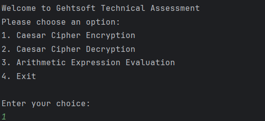
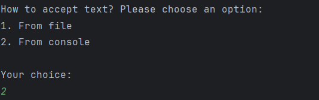
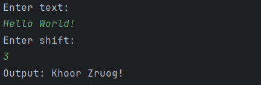
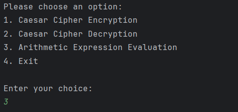
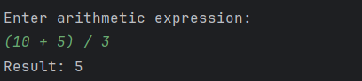

## About
_______________________

This application provides two functionalities:
1. Caesar Cipher encryption/decryption
2. Arithmetic expression evaluator

When you launch the application, a menu opens, and you can choose one of 4 options:
1. The first option allows you to encrypt text with the entered shift using the Caesar cipher. Text can be accepted from a file or console. Text can be in English or in Russian.
2. The second option allows you to decrypt text with and without a shift using the Caesar cipher. Text can be accepted from a file or console. Text can be in English or in Russian. If you don't specify a shift you will receive all possible variants of the decrypted text.
3. The third option allows you to evaluate a mathematical expression and get a calculated result. You can use decimal numbers, negative numbers, parenthesis and operations such as addition (+), subtraction (-), multiplication (*), division (/).
4. The fourth option allows you to exit the program.

## Usage
_______________________

1. Create a project in IntelliJ IDEA by cloning it from GitHub.

   1. Link to download IntelliJ IDEA: https://www.jetbrains.com/idea/download/?section=windows
   2. Navigate to the project on GitHub.
   3. Click the green button **Code** and then click the icon to the right of the HTTPS link to copy url to clipboard.
   4. Open IntelliJ IDEA.
      1. If this is first time opening IntelliJ IDEA choose **Get from VCS** option.
      2. If you are in a project you can choose **File** > **New** > **Project from Version Control**
   5. Paste the copied link from GitHub into the dialog box.
   6. Click Clone and the entire repository will be copied to your local machine.
2. Launch the project.
   1. Go to file **Main.java**
   2. Click the green triangle to the left of the class name or to the left of the method **main**.
   3. Choose **Run** and the application will be launched.

## Approach
_______________________

### **Caesar Cipher**

Caesar cipher is a type of substitution cipher in which each symbol in the plaintext is replaced with a symbol some constant number of positions to the left or right of it in the alphabet. For example, if the shift is 3, A will be replaced with D, B will become E, and so on.  

Encryption is a process of converting plaintext into ciphertext that can't be read normally.  
Decryption is a process of converting decrypted text (ciphertext) into normal text.  
Shift specifies how many shift should be applied on a character.

Formula for encryption: _**E(x) = (x + n)mod m**_  where **x** - letter number in the alphabet (A=0, B=1, etc.), **n** - shift and **m** - number of letters in the alphabet.  
Formula for encryption: _**D(x) = (x - n)mod m**_  where **x** - letter number in the alphabet (A=0, B=1, etc.), **n** - shift and **m** - number of letters in the alphabet.  

Example:  
* Plaintext: "Hello"
* Key: Shift by 3 (e.g., "A" becomes "D")
* Ciphertext: "Khoor"
* To decrypt: Shift "Khoor" back by 3 (e.g., "D" becomes "A")

### **Arithmetic expression evaluation**

Evaluation of an arithmetic expression is the process of calculating the value of a mathematical expression that contains numbers, operators (e.g. addition (+), subtraction (-), multiplication (*), division (/)), and possibly parentheses. Evaluation is performed according to the rules of operator precedence (first multiplication/division, then addition/subtraction), and optionally using parentheses to change the order of operations.  

The original expression is written in infix form, in which operators are between the operands, for example, 5 + 7. It's inconvenient to calculate the value of an expression written in infix form. It is easier to convert it to postfix form, in which the operator sign is written after its operands, for example, 5 7 +

There is a simple algorithm (Dijkstra) for converting an expression from infix form to postfix form taking into account the priorities of operations and parentheses. The algorithm works with a stack that stores operation signs. Initially, the stack is empty. The algorithm receives a sequence of tokens (numbers, parentheses, or operation signs) representing some arithmetic expression written in infix form. The result of the algorithm is an equivalent expression in postfix form. Operation priorities are introduced: the opening parenthesis has priority 0, the signs + and – have priority 1, and the signs * and / have priority 2.

1. If it's not the end of the input sequence, read the next token.
   1. If it's an operand (number), write it to the output sequence.
   2. If it's an opening parenthesis, push it onto the stack.
   3. If it's a closing parenthesis
      1. Pop everything from the stack into the output sequence until the opening parenthesis on the stack is reached.
      2. The parentheses themselves are destroyed.
   4. If it's an operator (current operator)
      1. Pop all operators with higher or equal priority from the stack into the output sequence.
      2. Put the current operator onto the stack.

2. If it's the end of the input sequence, pop everything from the stack into the output sequence and terminate.

The order of the operands in the output sequence doesn't differ from the order of the operands in the original sequence. There are no parentheses in the output sequence.

The algorithm described below can be used to calculate the value of an expression written in postfix form. The input is a sequence of tokens (numbers or operation signs) representing some arithmetic expression written in postfix form. The result of the algorithm is the value of this expression.

1. If it isn't the end of the input sequence, read the next token.
   1. If it's an operand (number), push it onto the stack.
   2. If it's an operator
      1. Pop two operands from the stack.
      2. Push the result of applying the operator to these operands, taken in reverse order, onto the stack.
2. If it's the end of the input sequence, terminate. The stack will contain a single number — the value of the expression.

This project uses an approach where the two upper algorithms are combined. In the first algorithm, instead of outputting to the output sequence, the token is passed directly to the input of the second algorithm and processed. In this case it's necessary to maintain two stacks simultaneously: one for operands and one for operators.

Example:

Mathematic expression: 7 * (6 + 5)  

characters: 7, *, (, 6, +, 5, )  
stack for operands:  
stack for operators:  

1. Push number '7' onto the stack for operands.  
   characters: *, (, 6, +, 5, )  
   stack for operands: 7  
   stack for operators:  

2. Stack for operators is empty. Push operator '*' onto the stack for operators.  
   characters: (, 6, +, 5, )  
   stack for operands: 7  
   stack for operators: *  

3. Push operator '(' onto the stack for operators.  
   characters: 6, +, 5, )  
   stack for operands: 7  
   stack for operators: *, (  

4. Push number '6' onto the stack for operands.  
   characters: +, 5, )  
   stack for operands: 7, 6  
   stack for operators: *, (  

5. There is no an operator with the same or greater precedence on top of the stack for operators. Push operator '+' onto the stack for operators.  
   characters: 5, )  
   stack for operands: 7, 6  
   stack for operators: *, (, +  

6. Push number '5' onto the stack for operands.  
   characters: )  
   stack for operands: 7, 6, 5  
   stack for operators: *, (, +

7. The next operator is ')', apply operator '+' to '5' and '6', push the result onto the stack for operands and pop operator '(' from the stack for operators.  
   characters:  
   stack for operands: 7, 11  
   stack for operators: *  

8. Apply operator '*' to '7' and '11' and push the result onto the stack for operands.  
   characters:  
   stack for operands: 77  
   stack for operators:  

Result: 77

## Examples of usage
_______________________

For example, we want to encrypt the text **Hello World!** with shift = 3 using Caesar cipher algorithm.
1. Launch the program and choose **Caesar Cipher Encryption** option.  
   
   
2. Choose how to accept text. Here **From console** was chosen.  
   
   
3. Enter text with shift and get the result.  
   
   

For example, we want to evaluate mathematical expression **(10 + 5) / 3**
1. Choose **Arithmetic Expression Evaluation** option.  
   
   
2. Enter arithmetic expression and get a result.  
   
   